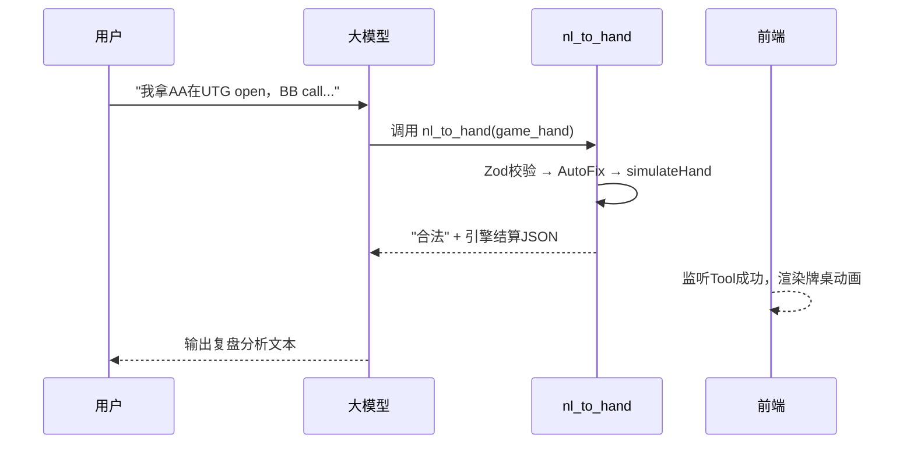
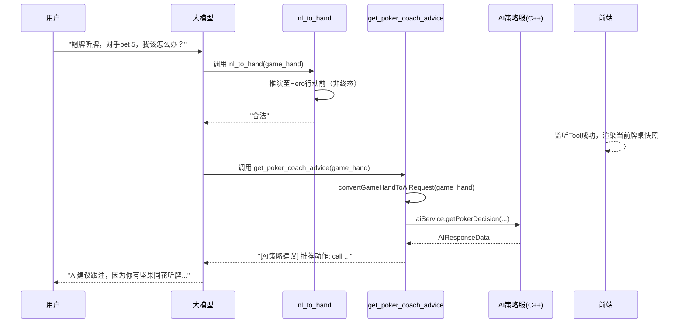

# 需求 01\_设计方案：自然语言转牌谱与 AI 打牌指导落地设计

> **版本**: v2 (基于代码审查与架构评审优化)
> **关联需求**: [需求 01.md](./需求01.md) > **关联审核**: [需求 01-审核.md](./需求01-审核.md)

---

## 1. 业务目标与场景定义

### 1.1 核心目标

将玩家非结构化的自然语言牌局描述，通过大模型 + 严格校验机制，转换为引擎可执行的合法结构化 JSON 牌谱（`game_hand`）。在此基础上赋能两大业务场景。

### 1.2 场景 A：主动复盘 (Review Mode)

- **业务描述**：用户以复盘语气回顾一手牌（已打完或中途结束），系统解析为合法牌谱，前端渲染回放，大模型给出总结分析。
- **目标动作**：生成牌谱 → 前端回放 → 语言总结。**不涉及** AI 策略服务调用。

### 1.3 场景 B：实时打牌指导 (Coach Mode)

- **业务描述**：用户在打牌进行中描述当前牌局并询问"我该怎么打"。系统解析出当前中断状态的牌局，向 AI 策略服务请求最优解，最后将解算结果翻译给用户。
- **目标动作**：生成非终态牌谱 → 渲染当前快照 → 请求 AI 策略服 → AI 结果转自然语言指导。

---

## 2. 工具 (Tools) 架构设计

大模型层注册两个核心 Tool，通过 System Prompt 统一管控调用流转。

### 2.1 Tool 1: `nl_to_hand` (牌谱生成与校验器) — 已实现

- **定位**：自然语言与结构化牌谱的"清洗者"与"守门员"。
- **当前实现位置**：`src/agent-tools/nl_to_hand/tools.ts`
- **核心逻辑**：基于 `hand_simulator`，执行四层校验（Zod → post-parse 修复 → 模拟器动态推演 → 结算守恒）。
- **入参**：`game_hand`（大模型初步生成的 `LatestHandType` JSON）。
- **出参契约**：
  - **成功**：纯文本 `合法`，附带引擎修正后的结算信息 JSON。
  - **失败**：带错误码、修复路径的诊断报告。
- **注册位置**：`src/agent-tools/tools.ts` → `getBaseTools()` 中已注册为 `nl_to_hand`。

### 2.2 Tool 2: `get_poker_coach_advice` (AI 策略求解器) — 待开发

- **定位**：连接后端 C++ 德州 AI 算法引擎的代理接口。
- **计划注册位置**：`src/agent-tools/nl_to_hand/tools.ts` 导出，在 `src/agent-tools/tools.ts` 的 `getBaseTools()` 中注册。
- **核心逻辑**：接收经 `nl_to_hand` 校验通过的合法 `game_hand`，转换为 `table_Type` 中间态，然后复用 `getAiReqData(table)` 组装 `AIHandData`，最终调用 `aiService.getPokerDecision(...)` 请求 AI 引擎。
- **调用约束**：大模型必须在 `nl_to_hand` 返回"合法"后，且判定为 Coach Mode 时才能调用。

#### 2.2.1 关键技术难点：数据格式转换桥接

这是 Tool 2 落地的**核心阻断点**。现有代码中存在两套不兼容的数据结构：

| 维度           | `nl_to_hand` 产出 (`LatestHandType`)                         | `getAiReqData` 需要 (`table_Type`)                                                                          |
| :------------- | :----------------------------------------------------------- | :---------------------------------------------------------------------------------------------------------- |
| **玩家结构**   | `{ id, seat_no, stack, name, position_tag, hole_card_list }` | `{ seatIdx, initChips, holdCards: card_Type[], isActive, isFold, isAllin, curBet, ... }` 等几十个运行时字段 |
| **行动记录**   | `actions: { action, seat_no, amount }[]` 扁平数组            | `table.aiActionList` 运行时状态                                                                             |
| **牌桌元数据** | `big_blind, dealer_seat, sb_seat, bb_seat`                   | `bb, btnSeatIdx, sbSeatIdx, bbSeatIdx, seatCount, state, currentPlayerIndex, ...`                           |

**解决方案**：必须编写一个 `convertGameHandToAiRequest(gameHand: LatestHandType): AIHandData` 桥接函数，直接从 `LatestHandType` 映射到 `AIHandData`（绕过 `table_Type`）。

映射规则如下（参考 `game_utils.ts:getAiReqData` L1454-L1517）：

```typescript
// 伪代码 - convertGameHandToAiRequest
function convertGameHandToAiRequest(hand: LatestHandType): AIHandData {
  return {
    gameuuid: hand.gameuuid,
    game_type: "No-Limit Hold'em",
    game_type_code: "nlhe",
    game_mode_code: "normal",
    players: hand.players.map((p) => ({
      seat_no: p.seat_no,
      stack: p.stack,
      name: p.name,
      hole_cards: p.hole_card_list || undefined, // 仅 Hero 有值
    })),
    big_blind: hand.big_blind,
    ante: hand.ante,
    dealer_seat: hand.dealer_seat,
    sb_seat: hand.sb_seat,
    bb_seat: hand.bb_seat,
    roomid: hand.roomid,
    straddle_seat: hand.straddle_seat,
    post_seats: [],
    actions: {
      entries: hand.actions.map((a) => ({
        action: a.action,
        seat_no: a.seat_no,
        amount: a.amount,
      })),
      pot_sizings: false,
      big_blind_size: hand.big_blind,
      big_blind_sizings: false,
    },
  };
}
```

#### 2.2.2 `getPokerDecision` 调用参数组装

参考 `session_manager.ts:requestAIDecision` (L1177-L1250)：

```typescript
// Tool 2 execute 内部伪代码
const aiHandData = convertGameHandToAiRequest(game_hand);
const actionId = Snowflake.getSnowflakeId(); // 生成唯一请求 ID
const tableId = game_hand.roomid;
const cardId = game_hand.gameuuid;

const [errCode, aiResponse] = await aiService.getPokerDecision(
  actionId,
  tableId,
  cardId,
  aiHandData,
  undefined, // heroPosition（可选）
  aiDecisionOptions, // 需从 game_hand 推导 currentPlayerIndex + hole_card
  aiOptionalData // 可选
);
```

其中 `aiDecisionOptions` 参考 `game_utils.ts:getGetPokerDecisionOptions` (L1519-L1536)：

```typescript
const heroPlayer = game_hand.players.find((p) => p.hole_card_list !== "");
const currentStreet = inferCurrentStreet(game_hand.actions); // 根据 actions 中发牌次数推断
const aiDecisionOptions = heroPlayer
  ? {
      playerProfileContext: {
        playerName: heroPlayer.name,
        current_street: currentStreet,
        hole_card: heroPlayer.hole_card_list,
      },
    }
  : undefined;
```

#### 2.2.3 出参契约

工具返回值为纯文本字符串（AI SDK tool 规范），供大模型解读并转述：

```
[AI策略建议]
推荐动作: raise
推荐金额: 15
策略分布: raise 80% / call 15% / fold 5%
EV分析: raise EV=+2.5BB, call EV=+1.2BB, fold EV=-1.0BB
```

失败时返回：

```
[AI策略服务异常] 请求超时或服务不可用，请稍后重试。
```

---

## 3. 大模型 (LLM) 交互流程管控

利用 LLM 作为 Orchestrator，通过 System Prompt 明确两种场景的工作流路由。

### 3.1 Prompt 路由管控策略 (SOP)

在 `mainSystemPrompt` 中注入严格的执行约束：

> 1. **强制验谱**：任何涉及牌局的情况，**第一步必须调用 `nl_to_hand`**，且直到其返回"合法"才允许进行下一步。
> 2. **复盘分支 (Review)**：若用户意图为复盘总结，在牌谱合法后，直接根据牌谱生成针对性语言复盘。**禁止调用 `get_poker_coach_advice`**。
> 3. **指导分支 (Coach)**：若用户意图为"求助下一步怎么打"（牌局未结束、轮到 Hero 行动），在牌谱合法后，**必须立即调用 `get_poker_coach_advice`**。获得解算结果后再转化为自然语言返回给用户。

### 3.2 场景 A (Review Mode) 时序流



### 3.3 场景 B (Coach Mode) 时序流



### 3.4 `stepCountIs` 约束

当前 `service.ts` 设置 `stopWhen: stepCountIs(10)`，即最多 10 个 step。场景 B 涉及 2 次工具调用 + 修复重试，极端情况下可能达到：

- Step 1: LLM 生成 JSON → 调 `nl_to_hand`
- Step 2: 校验失败，LLM 修复 → 再调 `nl_to_hand`
- Step 3: 校验成功，LLM 调 `get_poker_coach_advice`
- Step 4: LLM 生成最终回复

**结论**：10 步上限足够，但需要确保 `nl_to_hand` 的外层重试不超过 3 次（当前 description 中已有修复规则约束）。

---

## 4. 关键技术难点与落地对策

### 4.1 [P0] 非终态牌局的模拟器兼容

**现状问题**：当前 `simulateHand()` 在 `hand_simulator.ts` 中会执行完整的四层校验，包括结算校验（`validateSettlement`）。场景 B 的牌局停在 Hero 行动前，没有 Showdown，结算校验**必然失败**。

**落地对策**：

- 在 `hand_simulator.ts` 中增加对"非终态"的检测逻辑：当 `StreetManager` 推演完所有 actions 后，如果当前状态不是 `end/showdown/payout`，则**跳过** `validateSettlement`，直接返回 `buildOk()`。
- 判断依据：`StreetManager.replay()` 执行完毕后，检查 `table.state` 是否处于 `player_action` / `wait_oper_action` 等中间状态。
- **风险控制**：仅在 actions 列表完整回放完毕后才允许跳过，避免被恶意利用绕过校验。

### 4.2 [P0] 数据格式桥接 (`LatestHandType` → `AIHandData`)

**现状问题**：如 2.2.1 节所述，两套数据结构完全不兼容。

**落地对策**：

- 在 `src/agent-tools/nl_to_hand/` 下新建 `ai_bridge.ts`，实现 `convertGameHandToAiRequest()` 函数。
- 该函数**不依赖** `table_Type`，直接从 `LatestHandType` 字段映射到 `AIHandData` 字段。
- 需要额外实现 `inferCurrentStreet(actions)` 辅助函数：通过统计 actions 中 `seat_no === -1`（发牌动作）的出现次数来推断当前街道（0 次=preflop, 1 次=flop, 2 次=turn, 3 次=river）。

### 4.3 [P1] 场景 B 中"脑补"策略的风险

**现状问题**：`nl_to_hand` 的 description 中有"强制降级与脑补规范"（如默认筹码 100BB、默认花色等）。这在场景 A（复盘）中是合理的，但在场景 B（策略指导）中，错误的筹码深度会导致 AI 算出完全错误的策略。

**落地对策**：

- 短期方案：在 `get_poker_coach_advice` 的 description 中增加强约束，要求大模型在调用前**必须确认**用户提供了筹码深度信息，否则先追问。
- 长期方案：在 `get_poker_coach_advice` 的 `execute` 中增加前置校验，检测 `game_hand.players` 中是否所有 stack 都是默认值（`big_blind * 100`），如果是则返回警告文本要求补充信息。

### 4.4 [P1] AI 服超时与容错

**现状问题**：`session_manager.ts` 中的 `requestAIDecision` 已实现 `Promise.race` 超时机制（`AI_REQUEST_TIMEOUT_MS`）。Tool 2 需要复用相同的超时策略。

**落地对策**：

- Tool 2 的 `execute` 函数中直接复用相同的超时模式：

```typescript
const AI_TIMEOUT = (configTableManager.global_config.aiServiceRequestTimeoutMs || 8000) + 1000
const result = await Promise.race([
  aiService.getPokerDecision(...),
  new Promise((_, reject) => setTimeout(() => reject(new Error('AI timeout')), AI_TIMEOUT))
])
```

- 超时时返回友好文本：`"AI 策略服务暂时繁忙，请稍后再试。"`，而非抛出异常导致整个 streamText 中断。

### 4.5 [P2] SSE 流式中的等待体验

**现状问题**：从用户发话到 `nl_to_hand` 返回"合法"可能需要 3-8 秒（取决于 LLM 生成 JSON 的速度）。这段时间前端没有任何反馈。

**落地对策**：

- 当前架构使用 Vercel AI SDK 的 `streamText` + `toUIMessageStreamResponse`，前端通过 `useChat` 自动接收 SSE 流。
- LLM 在调用工具前会先输出 `_reasoning` 文本（思考过程），该文本通过 `sendReasoning: true` 已经在流式下发。前端可以监听这段文本，展示"AI 正在分析牌局..."的动态效果。
- Tool Call 的 `input` 参数（即 `game_hand` JSON）也会通过 SSE 下发到前端（AI SDK 的 `tool-call` part），前端可在收到后**提前预渲染**牌桌占位状态。

---

## 5. 文件结构与落地执行计划

### 5.1 需要新增/修改的文件

| 文件路径                                                      | 操作     | 说明                                                    |
| :------------------------------------------------------------ | :------- | :------------------------------------------------------ |
| `src/agent-tools/nl_to_hand/ai_bridge.ts`                     | **新增** | `convertGameHandToAiRequest()` + `inferCurrentStreet()` |
| `src/agent-tools/nl_to_hand/tools.ts`                         | **修改** | 导出 `createGetPokerCoachAdviceTool()`                  |
| `src/agent-tools/tools.ts`                                    | **修改** | 在 `getBaseTools()` 中注册 `get_poker_coach_advice`     |
| `src/feature/game_server/machine/simulator/hand_simulator.ts` | **修改** | `simulateHand` 增加非终态兼容                           |

### 5.2 分阶段执行计划

**阶段一：非终态兼容 (前置依赖)**

- 修改 `hand_simulator.ts`，在 `StreetManager.replay()` 执行完毕后检测状态，若为中间状态则跳过结算校验。
- 编写单测覆盖：完整牌局仍走结算校验、半截牌局跳过结算但通过前三层校验。

**阶段二：数据桥接层**

- 新建 `ai_bridge.ts`，实现 `convertGameHandToAiRequest()`。
- 编写单测：用一个已知的 `LatestHandType` 输入，验证产出的 `AIHandData` 与 `getAiReqData` 对等。

**阶段三：Tool 2 开发与注册**

- 在 `tools.ts` 中实现 `createGetPokerCoachAdviceTool()`，`execute` 为 async 函数。
- 使用 Mock AI 响应跑通 `streamText` 双工具链调用。
- 在 `getBaseTools()` 中注册。

**阶段四：System Prompt 与联调**

- 更新 `mainSystemPrompt`，注入场景路由 SOP（Review / Coach 分支）。
- 联调真实 AI 策略服，验证端到端流程。
- 优化 AI 返回结果到自然语言的 Prompt 调优。
